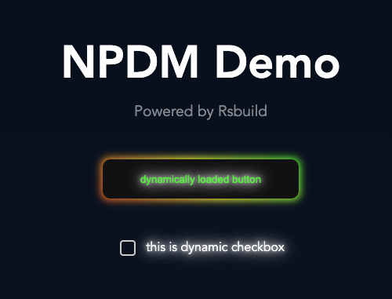
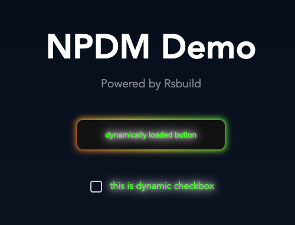

# Example

## Remote Component

### Repository

The remote component can be found on the Github: [akondratsky/npdm-react-example](https://github.com/akondratsky/npdm-react-example).

This component was created basically using Module Federation [Quick Start Guide](https://module-federation.io/guide/start/quick-start.html), with Rsbuild and Bun. Let's go through some key moments:

- In `rsbuild.config.ts` file `output.assetPrefix` option should be set to `'auto'`, because base URL will be always relative to the remote entry, which is never placed at the root
- In our example classic Javascript instead of manifest
- Under the `src/spec` folder we have to modules exposed in files `wonderfulButtonModule.ts` and `wonderfulCheckboxModule.ts`
- In `package.json` we have build script which builds package specification and the remote component per se

### Package

The resulting package contains `npdm` folder, where we can find folders `spec` and other files, related to the component. You can check it is published:

```sh
npm view npdmjs-react-example

# npdmjs-react-example@2.2.0 | MIT | deps: none | versions: 5
# https://github.com/akondratsky/npdm-react-example#readme
```

It is important to notice, that in `package.json` we export only specification, which will be used to connect this remote module to our application.

## Host Application

The simplest example of the host application can be found on the Github: [akondratsky/npdm-react-sandbox](https://github.com/akondratsky/npdm-react-sandbox).

There are two most important parts for us. The first is the server in the file `server.ts`, which does a few things:

```ts
const app = express();

// run NPDM router, accept all the versions of the `npdmjs-react-example`:
app.use('/npdm', createNpdmRouter({
  include: [{ name: 'npdmjs-react-example' }],
}));

// inject modules versions into the HTML document:
app.get('/', (req, res) => {
  const html = fs.readFileSync('./dist/index.html', 'utf-8');
  const versions = fs.readFileSync('./versions.json', 'utf-8');
  res.send(injectHTML(html, {
    headStart: `<script>window.NPDM_VERSION=${versions}</script>`,
  }));
});

// server static files of our main (host) application:
app.use(express.static('dist'));
```

Then in the client code we should retrieve expected modules versions, and load them dynamically:

```ts
import { connectModule, initNpdm } from '@npdm/module-federation';
import { checkboxModule, wonderfulButtonModule } from 'npdmjs-react-example';
import { lazy } from 'react';

// injected in server.ts
declare global {
  interface Window {
    NPDM_VERSION: {
      button: string;
      checkbox: string;
    }
  }
}

const { loadDynamicModule } = initNpdm({
  name: 'npdmjs-demo',
  // here our NPDM endpoint is located:
  npdmUrl: 'http://localhost:3333/npdm/',
}, {
  // components will be loaded dynamically:
  checkbox: connectModule(checkboxModule, window.NPDM_VERSION.checkbox),
  button: connectModule(wonderfulButtonModule, window.NPDM_VERSION.button),
});

// we will use loadDynamicModule() with our aliases for lazy components:
export const MyDynamicButton = lazy(() => loadDynamicModule('button'));
export const MyDynamicCheckbox = lazy(() => loadDynamicModule('checkbox'));
```

Since it is just the simplest example, all the versions a loaded with each request from the file `version.json` in the root folder of the project:

```json
{
  "checkbox": "2.1.1",
  "button": "2.2.0"
}
```

Now you can run the project with `bun run demo` command. We will see:



Let's modify file `version.json` and change version of "checkbox" to "2.2.0". Now if you update page you will see that another version of checkbox, with colored label, has been loaded.

