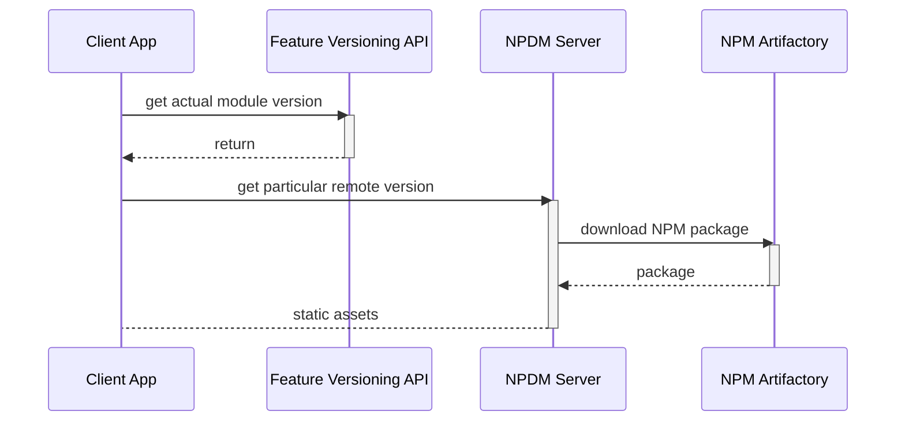

# Why NP(D)M?

## The Problem

Modern [microfrontend architecture](https://micro-frontends.org/) in enterprise applications demands several key features:

- Separate deployment for each sub-component
- Artifacts management with versioning
- Fast rollout and rollback for deployables

Technologies like [single-spa](https://single-spa.js.org/) and [Module Federation](https://module-federation.io/) address many microfrontend requirements. However, building and maintaining the necessary infrastructure for microfrontends in an enterprise environment remains complex and resource-intensive. This often requires a dedicated DevOps team for CI/CD and rollbacks, leading to additional costs for managing different artifact versions and deployments.

The primary goal of NPDM is to reduce costs by offering comprehensive microfrontends support with minimal infrastructure-building skills required. Ideally, all necessary infrastructure could be built using only JavaScript skills.

## The Solution

Module Federation is a state-of-the-art solution for creating microfrontends. It allows building sub-applications, deploying them separately, and associating them with a URL, such as `remote1@http://localhost:2001/mf-manifest.json`. However, pure Module Federation misses two critical requirements: microfrontends versioning and easy rollouts.

Module Federation 2.0 introduces a new concept called [Federation Runtime](https://module-federation.io/guide/basic/runtime.html). This approach enables the use of different packages and switching between them without redeployment, for example, using feature toggles.

With NP(D)M, there is no traditional deployment; all remotes are published as NPM packages. To use these packages, an NPDM Server is required to serve static assets from these packages. During runtime, you can easily change the version of the microfrontend you want to "deploy" and roll it out with the same ease.

 

