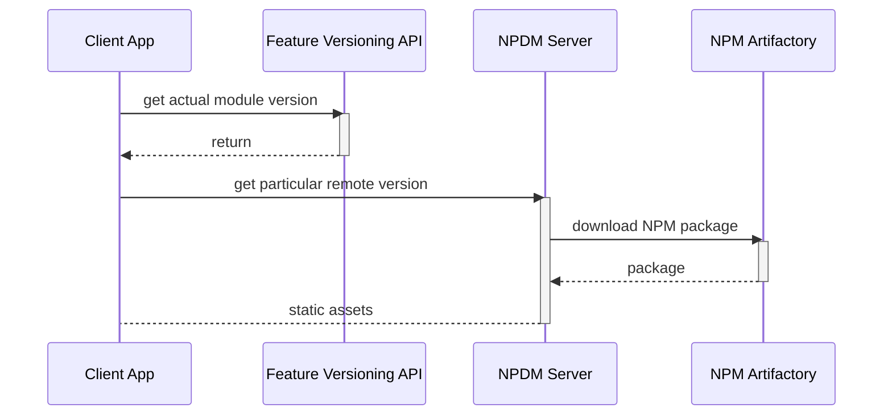

# Why NP(D)M?

## The Problem

The modern [microfrontend architecture](https://micro-frontends.org/) in enterprise applications implies a few important features:

- separate deployment for each sub-component
- artifacts management, with versioning
- fast rollout and rollback for deployables

While such well-known technologies as [single-spa](https://single-spa.js.org/) and [Module Federation](https://module-federation.io/) meet many requests regarding microfrontends. Nevertheless, building all the infrastructure and supporting microfrontends in the enterprise realities stays a huge overhead in terms of complexity and efforts; maintaining CI/CD and rollbacks may require involvement of a whole DevOps team in some cases, and extra costs, related to keeping different versions of artifacts and deploying them.

Main goal of NPDM is saving costs by providing full-spectrum microfrontends support with minimal requirements to skills, related to building infrastructure. Ideal situation could be described as the ability of building all the required infrastructure only with JS skills.

## The Solution

Module Federation is a state-of-art solution for creating microfrontends. It allows to build sub-applications, deploy them separately, and associate with some URL, for example: `remote1@http://localhost:2001/mf-manifest.json`. Unfortunately, two very important requirements are left out of board with pure Module Federation: microfrontends versioning and rollout simplicity.

In Module Federation 2.0 the new concept was introduced, [Federation Runtime](https://module-federation.io/guide/basic/runtime.html). Such an approach could allow usage of a different packages and switching between them even without real re-deployment, for example, with some feature toggles.

With the NP(D)M there is no deployment as such; we publish all our remotes as NPM packages. To make usage of such packages possible, we will need an instance of server, which will serve static assets from such packages, we will call it NPDM Server. Then, in runtime, we can just change the version of the microfrontend we want to "deploy". With the same easy it can be rolled out.

